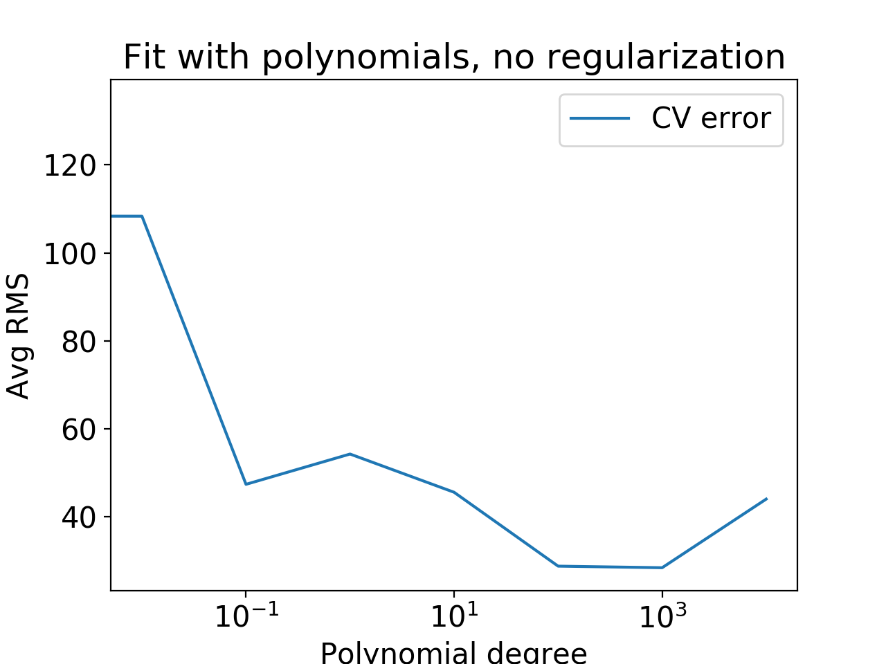

# Linear Regression 

The dataset for this machine learning project is created from data provided by UNICEF’s State of the World’s Children 2013 report:
http://www.unicef.org/sowc2013/statistics.html    
Child mortality rates (number of children who die before age 5, per 1000 live births) for 195 countries, and a set of other indicators are included.

• Target value: (Under-5 mortality rate (U5MR) 2011)
• Input features: Major factors in these areas (eg: Annual no. of under-5 deaths (thousands) 2011).
• Training data: 100 countries(Afghanistan to Luxembourg).
• Testing data: 95 countries(Madagascar to Zimbabwe).
• Cross-validation: 10 folds Cross-validation.

***Polynomial basis function regression*** 

unregularized for degree 1 to degree 6 polynomials. Include bias term.
Error function:    

***Sigmoid basis function regression*** 
   

a single input feature(GNI per capita (US$) 2011', 'Life expectancy at birth (years) 2011), with µ = 100 and s = 2000.0. Include a bias term.

***L2-regularized regression***

 Fit a degree 2 polynomial using λ = {0, .01, .1, 1, 10, 10^2 , 10^3, 10^4}. Use normalized features as input. Include a bias term. Use 10-fold cross-validation to decide on the best value for λ.    
 Error function: 

 

 the best $\lambda $ should aound 10^2 to 10^3.
